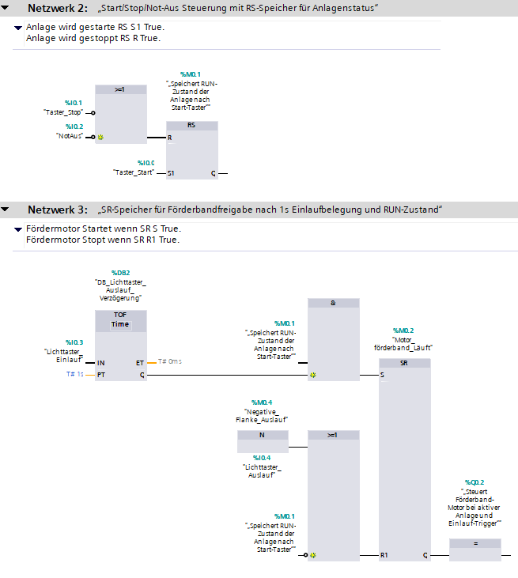
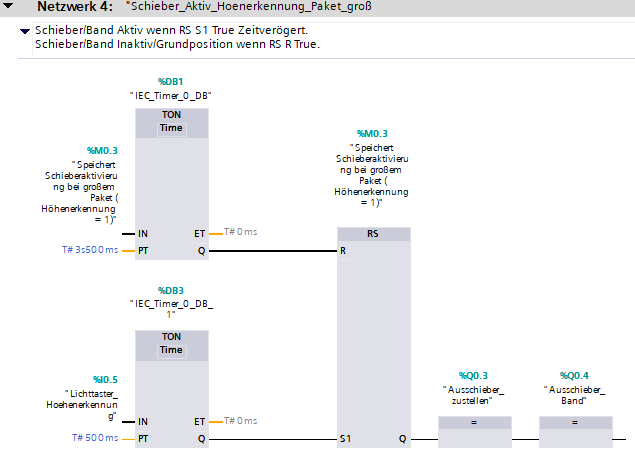
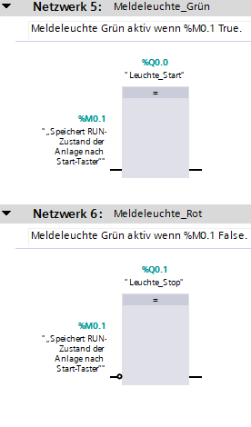

# SPS-Projekt: Ausschiebersteuerung mit TON, TOF und RS-Logik  
**Lernprojekt – Tag 4**

Dieses Projekt zeigt eine SPS-Steuerung für eine kleine Förderanlage mit Ausschieberfunktion.  
Es wurde in TIA Portal erstellt und demonstriert typische industrielle Abläufe wie Start/Stop/Not-Aus,
Förderbandlogik, Paket-Höhenerkennung und zeitverzögerte Ausschieberaktivierung.

---

## 🔧 Funktionen im Überblick

### ✔️ Start/Stop/Not-Aus
- Steuerung über Taster
- RS-Speicher für RUN-Zustand (%M0.1)
- Not-Aus setzt Anlage sofort zurück

### ✔️ Förderbandsteuerung
- Einlauf-Lichttaster aktiviert TOF (1s)
- Band läuft nur bei RUN + gültigem Einlaufsignal
- Rückstellung über Auslauf-Lichttaster

### ✔️ Ausschiebersteuerung
- TON-Verzögerung (3,5s) bei Paket „groß“
- RS-Speicher für Schieberaktivierung
- Zweiter TON (0,5s) für Ausschieber-Band
- Rückstellung über Sensor + Timer

### ✔️ Meldeleuchten
- Grün = Anlage läuft
- Rot = Anlage steht

---

## 🔍 Vorschau der Netzwerke

### Netzwerk 2 – Start/Stop/Not-Aus


### Netzwerk 3 – Förderbandfreigabe


### Netzwerk 4 – Ausschiebersteuerung


---

## 💻 Logik-Ausschnitt (vereinfacht)

```plaintext
// Ausschiebersteuerung bei Paket groß

TON (PT = T#3s500ms)
IN: %M0.3  // Paket groß erkannt
Q → RS.S

RS-Speicher
S: TON.Q
R: %M0.3
Q → TON2.IN

TON2 (PT = T#500ms)
IN: RS.Q
Q → %Q0.3 (Ausschieber)
     %Q0.4 (Ausschieber-Band)
